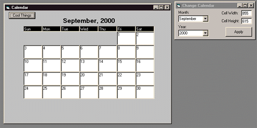



## Create your own calendar with only 3 single controls and good old VB Code\! \( See Screenshot \)

### Description

Take a blank form with 3 Labels, add some VB code and it turns out to be a method of making your own Custom Calendar Control or Application!! (EXE INCLUDED) *Please Vote*
 
### More Info
 

             |
---                |---
**Submitted On**   |2000-09-29 16:51:02
**By**             |[Sparq](https://github.com/Planet-Source-Code/PSCIndex/blob/master/ByAuthor/sparq.md)
**Level**          |Intermediate
**User Rating**    |4.6 (51 globes from 11 users)
**Compatibility**  |VB 6\.0
**Category**       |[Math/ Dates](https://github.com/Planet-Source-Code/PSCIndex/blob/master/ByCategory/math-dates__1-37.md)
**World**          |[Visual Basic](https://github.com/Planet-Source-Code/PSCIndex/blob/master/ByWorld/visual-basic.md)
**Archive File**   |[CODE\_UPLOAD102769292000\.zip](https://github.com/Planet-Source-Code/sparq-create-your-own-calendar-with-only-3-single-controls-and-good-old-vb-code-see-screen__1-11761/archive/master.zip)

